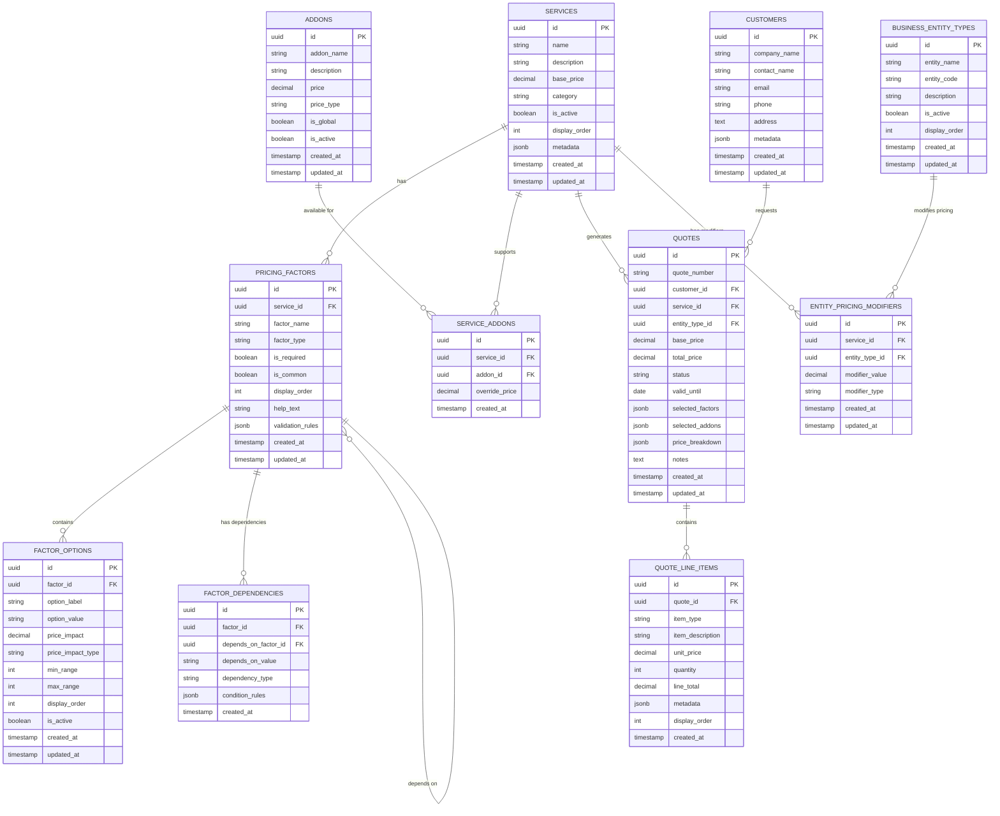

[← Back to Main PRD](../PRD_Financial_Services_Pricing_Calculator.md)

> **Context:** This document defines the database schema, entity relationships, and data models required to support the pricing calculator and quote management system.

## 6. Data Schema & Architecture

### 6.1 Database Choice: PostgreSQL

**Rationale:**
- Strong relational integrity for complex pricing relationships
- JSONB support for flexible factor configurations
- Excellent performance for financial calculations
- Robust transaction support for quote generation
- Superior reporting and analytics capabilities
- Better suited for multi-tenant scenarios (future)

### 6.2 Core Entities Overview

The schema consists of 12 core tables organized into four functional groups:

1. **Service Configuration:** Services, Pricing Factors, Factor Options, Factor Dependencies
2. **Business Rules:** Business Entity Types, Entity Pricing Modifiers, Add-ons, Service Add-ons
3. **Quote Management:** Customers, Quotes, Quote Line Items
4. **System:** Audit Log (for tracking pricing changes)

### 6.3 Entity Relationship Diagram



### 6.4 Detailed Table Definitions

#### 6.4.1 SERVICES Table

Stores all available financial services (Bookkeeping, Payroll, etc.)

```sql
CREATE TABLE services (
    id UUID PRIMARY KEY DEFAULT gen_random_uuid(),
    name VARCHAR(255) NOT NULL UNIQUE,
    description TEXT,
    base_price DECIMAL(10, 2) DEFAULT 0.00,
    category VARCHAR(100),
    is_active BOOLEAN DEFAULT true,
    display_order INTEGER DEFAULT 0,
    metadata JSONB DEFAULT '{}',
    created_at TIMESTAMP DEFAULT CURRENT_TIMESTAMP,
    updated_at TIMESTAMP DEFAULT CURRENT_TIMESTAMP
);

CREATE INDEX idx_services_active ON services(is_active);
CREATE INDEX idx_services_category ON services(category);
```

**Column Descriptions:**
- `id`: Unique identifier
- `name`: Service name (e.g., "Bookkeeping", "Payroll")
- `description`: Detailed service description for clients
- `base_price`: Optional base price (can be 0 if fully factor-driven)
- `category`: Group services (e.g., "Accounting", "Tax", "Advisory")
- `is_active`: Enable/disable service without deletion
- `display_order`: Control display sequence in UI
- `metadata`: Flexible JSON for future extensions (icons, colors, etc.)

**Sample Data:**
```sql
INSERT INTO services (name, description, base_price, category, display_order) VALUES
('Bookkeeping', 'Monthly bookkeeping services including transaction categorization and reconciliation', 200.00, 'Accounting', 1),
('Payroll', 'Comprehensive payroll processing and tax filing services', 150.00, 'Payroll', 2),
('Year End Accounting', 'Annual financial statement preparation and closing', 500.00, 'Accounting', 3),
('Tax Preparation', 'Business tax return preparation and filing', 300.00, 'Tax', 4),
('CFO Services', 'Part-time CFO advisory and strategic financial planning', 1000.00, 'Advisory', 5);
```

---

#### 6.4.2 PRICING_FACTORS Table

Defines configurable pricing factors for each service

```sql
CREATE TABLE pricing_factors (
    id UUID PRIMARY KEY DEFAULT gen_random_uuid(),
    service_id UUID REFERENCES services(id) ON DELETE CASCADE,
    factor_name VARCHAR(255) NOT NULL,
    factor_type VARCHAR(50) NOT NULL, -- 'select', 'range', 'numeric', 'boolean'
    is_required BOOLEAN DEFAULT true,
    is_common BOOLEAN DEFAULT false, -- true if applies to all services
    display_order INTEGER DEFAULT 0,
    help_text TEXT,
    validation_rules JSONB DEFAULT '{}',
    created_at TIMESTAMP DEFAULT CURRENT_TIMESTAMP,
    updated_at TIMESTAMP DEFAULT CURRENT_TIMESTAMP,

    CONSTRAINT unique_service_factor UNIQUE(service_id, factor_name)
);

CREATE INDEX idx_pricing_factors_service ON pricing_factors(service_id);
CREATE INDEX idx_pricing_factors_common ON pricing_factors(is_common);
```

**Column Descriptions:**
- `service_id`: Links to specific service (NULL if common factor)
- `factor_name`: Factor display name (e.g., "Number of Transactions", "Report Frequency")
- `factor_type`: Data type for UI rendering
  - `select`: Dropdown with predefined options
  - `range`: Numeric range selector (e.g., 0-1000, 1001-1500)
  - `numeric`: Free-form number input
  - `boolean`: Yes/No toggle
- `is_required`: Must be selected to calculate price
- `is_common`: Applies to all services (e.g., Business Entity Type)
- `display_order`: Control field order in forms
- `help_text`: Tooltip or help text for users
- `validation_rules`: JSON rules (min/max values, regex patterns, etc.)

**Sample Data:**
```sql
-- Common factor (applies to all services)
INSERT INTO pricing_factors (service_id, factor_name, factor_type, is_required, is_common, display_order, help_text) VALUES
(NULL, 'Business Entity Type', 'select', true, true, 1, 'Select your business structure');

-- Bookkeeping-specific factors
INSERT INTO pricing_factors (service_id, factor_name, factor_type, is_required, is_common, display_order, help_text) VALUES
((SELECT id FROM services WHERE name = 'Bookkeeping'), 'Number of Transactions', 'range', true, false, 2, 'Average monthly transactions'),
((SELECT id FROM services WHERE name = 'Bookkeeping'), 'Report Frequency', 'select', true, false, 3, 'How often do you need financial reports?'),
((SELECT id FROM services WHERE name = 'Bookkeeping'), 'Accounting Software', 'select', true, false, 4, 'Which software do you use?');

-- Payroll-specific factors
INSERT INTO pricing_factors (service_id, factor_name, factor_type, is_required, is_common, display_order, help_text) VALUES
((SELECT id FROM services WHERE name = 'Payroll'), 'Number of Employees', 'range', true, false, 2, 'Total number of employees on payroll'),
((SELECT id FROM services WHERE name = 'Payroll'), 'Payroll Frequency', 'select', true, false, 3, 'How often do you run payroll?'),
((SELECT id FROM services WHERE name = 'Payroll'), 'Multi-State Operations', 'boolean', false, false, 4, 'Do you have employees in multiple states?');
```

---

#### 6.4.3 FACTOR_OPTIONS Table

Stores specific options and their pricing for each factor

```sql
CREATE TABLE factor_options (
    id UUID PRIMARY KEY DEFAULT gen_random_uuid(),
    factor_id UUID REFERENCES pricing_factors(id) ON DELETE CASCADE,
    option_label VARCHAR(255) NOT NULL,
    option_value VARCHAR(255) NOT NULL,
    price_impact DECIMAL(10, 2) DEFAULT 0.00,
    price_impact_type VARCHAR(20) DEFAULT 'fixed', -- 'fixed', 'percentage', 'multiplier'
    min_range INTEGER, -- For range-type factors
    max_range INTEGER, -- For range-type factors
    display_order INTEGER DEFAULT 0,
    is_active BOOLEAN DEFAULT true,
    created_at TIMESTAMP DEFAULT CURRENT_TIMESTAMP,
    updated_at TIMESTAMP DEFAULT CURRENT_TIMESTAMP
);

CREATE INDEX idx_factor_options_factor ON factor_options(factor_id);
CREATE INDEX idx_factor_options_active ON factor_options(is_active);
```

**Column Descriptions:**
- `factor_id`: Links to pricing factor
- `option_label`: Display text (e.g., "Monthly", "0-1000 transactions")
- `option_value`: Stored value (e.g., "monthly", "0-1000")
- `price_impact`: The price adjustment for this option
- `price_impact_type`: How to apply the price
  - `fixed`: Add/subtract fixed amount (e.g., +$200)
  - `percentage`: Apply percentage change (e.g., +15%)
  - `multiplier`: Multiply current price (e.g., 1.5x)
- `min_range` / `max_range`: For numeric range options
- `display_order`: Control option sequence
- `is_active`: Enable/disable without deletion

**Sample Data:**
```sql
-- Business Entity Type options (common factor)
INSERT INTO factor_options (factor_id, option_label, option_value, price_impact, price_impact_type, display_order) VALUES
((SELECT id FROM pricing_factors WHERE factor_name = 'Business Entity Type'), 'Sole Proprietor', 'sole_proprietor', 0.00, 'fixed', 1),
((SELECT id FROM pricing_factors WHERE factor_name = 'Business Entity Type'), 'Partnership', 'partnership', 50.00, 'fixed', 2),
((SELECT id FROM pricing_factors WHERE factor_name = 'Business Entity Type'), 'LLC', 'llc', 75.00, 'fixed', 3),
((SELECT id FROM pricing_factors WHERE factor_name = 'Business Entity Type'), 'S-Corp', 's_corp', 100.00, 'fixed', 4),
((SELECT id FROM pricing_factors WHERE factor_name = 'Business Entity Type'), 'C-Corp', 'c_corp', 150.00, 'fixed', 5),
((SELECT id FROM pricing_factors WHERE factor_name = 'Business Entity Type'), 'Company', 'company', 200.00, 'fixed', 6);

-- Bookkeeping: Number of Transactions
INSERT INTO factor_options (factor_id, option_label, option_value, price_impact, price_impact_type, min_range, max_range, display_order) VALUES
((SELECT id FROM pricing_factors WHERE factor_name = 'Number of Transactions' AND service_id = (SELECT id FROM services WHERE name = 'Bookkeeping')),
 '0-1000 transactions', '0-1000', 0.00, 'fixed', 0, 1000, 1),
((SELECT id FROM pricing_factors WHERE factor_name = 'Number of Transactions' AND service_id = (SELECT id FROM services WHERE name = 'Bookkeeping')),
 '1001-1500 transactions', '1001-1500', 150.00, 'fixed', 1001, 1500, 2),
((SELECT id FROM pricing_factors WHERE factor_name = 'Number of Transactions' AND service_id = (SELECT id FROM services WHERE name = 'Bookkeeping')),
 '1501-2000 transactions', '1501-2000', 300.00, 'fixed', 1501, 2000, 3),
((SELECT id FROM pricing_factors WHERE factor_name = 'Number of Transactions' AND service_id = (SELECT id FROM services WHERE name = 'Bookkeeping')),
 '2001-3000 transactions', '2001-3000', 500.00, 'fixed', 2001, 3000, 4),
((SELECT id FROM pricing_factors WHERE factor_name = 'Number of Transactions' AND service_id = (SELECT id FROM services WHERE name = 'Bookkeeping')),
 '3000+ transactions', '3000+', 800.00, 'fixed', 3001, NULL, 5);

-- Bookkeeping: Report Frequency
INSERT INTO factor_options (factor_id, option_label, option_value, price_impact, price_impact_type, display_order) VALUES
((SELECT id FROM pricing_factors WHERE factor_name = 'Report Frequency' AND service_id = (SELECT id FROM services WHERE name = 'Bookkeeping')),
 'Yearly', 'yearly', 0.00, 'fixed', 1),
((SELECT id FROM pricing_factors WHERE factor_name = 'Report Frequency' AND service_id = (SELECT id FROM services WHERE name = 'Bookkeeping')),
 'Half-Yearly', 'half_yearly', 100.00, 'fixed', 2),
((SELECT id FROM pricing_factors WHERE factor_name = 'Report Frequency' AND service_id = (SELECT id FROM services WHERE name = 'Bookkeeping')),
 'Quarterly', 'quarterly', 200.00, 'fixed', 3),
((SELECT id FROM pricing_factors WHERE factor_name = 'Report Frequency' AND service_id = (SELECT id FROM services WHERE name = 'Bookkeeping')),
 'Monthly', 'monthly', 350.00, 'fixed', 4);

-- Bookkeeping: Accounting Software
INSERT INTO factor_options (factor_id, option_label, option_value, price_impact, price_impact_type, display_order) VALUES
((SELECT id FROM pricing_factors WHERE factor_name = 'Accounting Software' AND service_id = (SELECT id FROM services WHERE name = 'Bookkeeping')),
 'QuickBooks Online', 'qbo', 0.00, 'fixed', 1),
((SELECT id FROM pricing_factors WHERE factor_name = 'Accounting Software' AND service_id = (SELECT id FROM services WHERE name = 'Bookkeeping')),
 'QuickBooks Desktop', 'qbd', 50.00, 'fixed', 2),
((SELECT id FROM pricing_factors WHERE factor_name = 'Accounting Software' AND service_id = (SELECT id FROM services WHERE name = 'Bookkeeping')),
 'Xero', 'xero', 0.00, 'fixed', 3),
((SELECT id FROM pricing_factors WHERE factor_name = 'Accounting Software' AND service_id = (SELECT id FROM services WHERE name = 'Bookkeeping')),
 'Manual/Spreadsheet', 'manual', 200.00, 'fixed', 4);

-- Payroll: Number of Employees
INSERT INTO factor_options (factor_id, option_label, option_value, price_impact, price_impact_type, min_range, max_range, display_order) VALUES
((SELECT id FROM pricing_factors WHERE factor_name = 'Number of Employees' AND service_id = (SELECT id FROM services WHERE name = 'Payroll')),
 '1-10 employees', '1-10', 0.00, 'fixed', 1, 10, 1),
((SELECT id FROM pricing_factors WHERE factor_name = 'Number of Employees' AND service_id = (SELECT id FROM services WHERE name = 'Payroll')),
 '11-50 employees', '11-50', 200.00, 'fixed', 11, 50, 2),
((SELECT id FROM pricing_factors WHERE factor_name = 'Number of Employees' AND service_id = (SELECT id FROM services WHERE name = 'Payroll')),
 '51-100 employees', '51-100', 500.00, 'fixed', 51, 100, 3),
((SELECT id FROM pricing_factors WHERE factor_name = 'Number of Employees' AND service_id = (SELECT id FROM services WHERE name = 'Payroll')),
 '100+ employees', '100+', 1000.00, 'fixed', 101, NULL, 4);

-- Payroll: Payroll Frequency
INSERT INTO factor_options (factor_id, option_label, option_value, price_impact, price_impact_type, display_order) VALUES
((SELECT id FROM pricing_factors WHERE factor_name = 'Payroll Frequency' AND service_id = (SELECT id FROM services WHERE name = 'Payroll')),
 'Monthly', 'monthly', 0.00, 'fixed', 1),
((SELECT id FROM pricing_factors WHERE factor_name = 'Payroll Frequency' AND service_id = (SELECT id FROM services WHERE name = 'Payroll')),
 'Bi-Weekly', 'bi_weekly', 100.00, 'fixed', 2),
((SELECT id FROM pricing_factors WHERE factor_name = 'Payroll Frequency' AND service_id = (SELECT id FROM services WHERE name = 'Payroll')),
 'Weekly', 'weekly', 200.00, 'fixed', 3);
```

---

#### 6.4.4 FACTOR_DEPENDENCIES Table

Manages conditional factor visibility and validation

```sql
CREATE TABLE factor_dependencies (
    id UUID PRIMARY KEY DEFAULT gen_random_uuid(),
    factor_id UUID REFERENCES pricing_factors(id) ON DELETE CASCADE,
    depends_on_factor_id UUID REFERENCES pricing_factors(id) ON DELETE CASCADE,
    depends_on_value VARCHAR(255), -- The value that triggers this dependency
    dependency_type VARCHAR(50) DEFAULT 'show_if', -- 'show_if', 'hide_if', 'require_if'
    condition_rules JSONB DEFAULT '{}', -- Complex conditions (AND/OR logic)
    created_at TIMESTAMP DEFAULT CURRENT_TIMESTAMP,

    CONSTRAINT no_self_dependency CHECK (factor_id != depends_on_factor_id)
);

CREATE INDEX idx_factor_dependencies_factor ON factor_dependencies(factor_id);
CREATE INDEX idx_factor_dependencies_depends_on ON factor_dependencies(depends_on_factor_id);
```

**Column Descriptions:**
- `factor_id`: The dependent factor (the one that appears/hides)
- `depends_on_factor_id`: The factor it depends on
- `depends_on_value`: The specific value that triggers the dependency
- `dependency_type`: How the dependency behaves
  - `show_if`: Only show factor if condition is met
  - `hide_if`: Hide factor if condition is met
  - `require_if`: Make factor required if condition is met
- `condition_rules`: JSON for complex conditions (future enhancement)

**Sample Data:**
```sql
-- Example: Show "Multi-State Operations" only if employees > 10
INSERT INTO factor_dependencies (factor_id, depends_on_factor_id, depends_on_value, dependency_type) VALUES
((SELECT id FROM pricing_factors WHERE factor_name = 'Multi-State Operations' AND service_id = (SELECT id FROM services WHERE name = 'Payroll')),
 (SELECT id FROM pricing_factors WHERE factor_name = 'Number of Employees' AND service_id = (SELECT id FROM services WHERE name = 'Payroll')),
 '11-50', 'show_if');

-- Note: Would need multiple rows for "11-50", "51-100", "100+" or use condition_rules for range logic
```

---

#### 6.4.5 BUSINESS_ENTITY_TYPES Table

Defines available business entity types

```sql
CREATE TABLE business_entity_types (
    id UUID PRIMARY KEY DEFAULT gen_random_uuid(),
    entity_name VARCHAR(100) NOT NULL UNIQUE,
    entity_code VARCHAR(50) NOT NULL UNIQUE,
    description TEXT,
    is_active BOOLEAN DEFAULT true,
    display_order INTEGER DEFAULT 0,
    created_at TIMESTAMP DEFAULT CURRENT_TIMESTAMP,
    updated_at TIMESTAMP DEFAULT CURRENT_TIMESTAMP
);

CREATE INDEX idx_entity_types_active ON business_entity_types(is_active);
```

**Sample Data:**
```sql
INSERT INTO business_entity_types (entity_name, entity_code, description, display_order) VALUES
('Sole Proprietor', 'sole_proprietor', 'Single-owner unincorporated business', 1),
('Partnership', 'partnership', 'Business owned by two or more partners', 2),
('LLC', 'llc', 'Limited Liability Company', 3),
('S-Corporation', 's_corp', 'Small business corporation with pass-through taxation', 4),
('C-Corporation', 'c_corp', 'Standard corporation with double taxation', 5),
('Company', 'company', 'General company designation', 6),
('Non-Profit', 'non_profit', '501(c)(3) or other non-profit organization', 7);
```

---

#### 6.4.6 ENTITY_PRICING_MODIFIERS Table

Service-specific pricing adjustments for entity types

```sql
CREATE TABLE entity_pricing_modifiers (
    id UUID PRIMARY KEY DEFAULT gen_random_uuid(),
    service_id UUID REFERENCES services(id) ON DELETE CASCADE,
    entity_type_id UUID REFERENCES business_entity_types(id) ON DELETE CASCADE,
    modifier_value DECIMAL(10, 2) NOT NULL,
    modifier_type VARCHAR(20) DEFAULT 'fixed', -- 'fixed', 'percentage', 'multiplier'
    created_at TIMESTAMP DEFAULT CURRENT_TIMESTAMP,
    updated_at TIMESTAMP DEFAULT CURRENT_TIMESTAMP,

    CONSTRAINT unique_service_entity UNIQUE(service_id, entity_type_id)
);

CREATE INDEX idx_entity_modifiers_service ON entity_pricing_modifiers(service_id);
CREATE INDEX idx_entity_modifiers_entity ON entity_pricing_modifiers(entity_type_id);
```

**Column Descriptions:**
- `service_id`: The service this modifier applies to
- `entity_type_id`: The entity type
- `modifier_value`: The adjustment amount
- `modifier_type`: How to apply
  - `fixed`: Add fixed amount
  - `percentage`: Add percentage of base price
  - `multiplier`: Multiply total by this value

**Sample Data:**
```sql
-- Bookkeeping entity modifiers
INSERT INTO entity_pricing_modifiers (service_id, entity_type_id, modifier_value, modifier_type) VALUES
((SELECT id FROM services WHERE name = 'Bookkeeping'), (SELECT id FROM business_entity_types WHERE entity_code = 'sole_proprietor'), 0.00, 'multiplier'),
((SELECT id FROM services WHERE name = 'Bookkeeping'), (SELECT id FROM business_entity_types WHERE entity_code = 'partnership'), 1.15, 'multiplier'),
((SELECT id FROM services WHERE name = 'Bookkeeping'), (SELECT id FROM business_entity_types WHERE entity_code = 'llc'), 1.20, 'multiplier'),
((SELECT id FROM services WHERE name = 'Bookkeeping'), (SELECT id FROM business_entity_types WHERE entity_code = 's_corp'), 1.30, 'multiplier'),
((SELECT id FROM services WHERE name = 'Bookkeeping'), (SELECT id FROM business_entity_types WHERE entity_code = 'c_corp'), 1.50, 'multiplier'),
((SELECT id FROM services WHERE name = 'Bookkeeping'), (SELECT id FROM business_entity_types WHERE entity_code = 'company'), 1.50, 'multiplier');
```

---

#### 6.4.7 ADDONS Table

Optional add-on services or features

```sql
CREATE TABLE addons (
    id UUID PRIMARY KEY DEFAULT gen_random_uuid(),
    addon_name VARCHAR(255) NOT NULL UNIQUE,
    description TEXT,
    price DECIMAL(10, 2) NOT NULL,
    price_type VARCHAR(20) DEFAULT 'fixed', -- 'fixed', 'percentage'
    is_global BOOLEAN DEFAULT false, -- true if available for all services
    is_active BOOLEAN DEFAULT true,
    created_at TIMESTAMP DEFAULT CURRENT_TIMESTAMP,
    updated_at TIMESTAMP DEFAULT CURRENT_TIMESTAMP
);

CREATE INDEX idx_addons_global ON addons(is_global);
CREATE INDEX idx_addons_active ON addons(is_active);
```

**Sample Data:**
```sql
INSERT INTO addons (addon_name, description, price, price_type, is_global) VALUES
('Rush Service (48-hour turnaround)', 'Expedited processing with 48-hour delivery', 200.00, 'fixed', true),
('Priority Support', 'Dedicated account manager and priority phone support', 150.00, 'fixed', true),
('Multi-Currency Support', 'Handle transactions in multiple currencies', 100.00, 'fixed', false),
('Industry-Specific Reporting', 'Custom reports for specific industries (construction, e-commerce, etc.)', 175.00, 'fixed', false),
('Cloud Storage Integration', 'Automatic backup to Dropbox/Google Drive', 50.00, 'fixed', true);
```

---

#### 6.4.8 SERVICE_ADDONS Table

Links add-ons to specific services (for non-global add-ons)

```sql
CREATE TABLE service_addons (
    id UUID PRIMARY KEY DEFAULT gen_random_uuid(),
    service_id UUID REFERENCES services(id) ON DELETE CASCADE,
    addon_id UUID REFERENCES addons(id) ON DELETE CASCADE,
    override_price DECIMAL(10, 2), -- Optional: Override the default addon price for this service
    created_at TIMESTAMP DEFAULT CURRENT_TIMESTAMP,

    CONSTRAINT unique_service_addon UNIQUE(service_id, addon_id)
);

CREATE INDEX idx_service_addons_service ON service_addons(service_id);
CREATE INDEX idx_service_addons_addon ON service_addons(addon_id);
```

**Sample Data:**
```sql
-- Make "Multi-Currency Support" available for Bookkeeping
INSERT INTO service_addons (service_id, addon_id) VALUES
((SELECT id FROM services WHERE name = 'Bookkeeping'), (SELECT id FROM addons WHERE addon_name = 'Multi-Currency Support'));

-- Make "Industry-Specific Reporting" available for Bookkeeping with custom price
INSERT INTO service_addons (service_id, addon_id, override_price) VALUES
((SELECT id FROM services WHERE name = 'Bookkeeping'), (SELECT id FROM addons WHERE addon_name = 'Industry-Specific Reporting'), 200.00);
```

---

#### 6.4.9 CUSTOMERS Table

Client/prospect information

```sql
CREATE TABLE customers (
    id UUID PRIMARY KEY DEFAULT gen_random_uuid(),
    company_name VARCHAR(255),
    contact_name VARCHAR(255) NOT NULL,
    email VARCHAR(255) NOT NULL,
    phone VARCHAR(50),
    address TEXT,
    metadata JSONB DEFAULT '{}', -- Additional custom fields
    created_at TIMESTAMP DEFAULT CURRENT_TIMESTAMP,
    updated_at TIMESTAMP DEFAULT CURRENT_TIMESTAMP
);

CREATE INDEX idx_customers_email ON customers(email);
CREATE INDEX idx_customers_company ON customers(company_name);
```

**Sample Data:**
```sql
INSERT INTO customers (company_name, contact_name, email, phone, address) VALUES
('Acme Retail Inc.', 'John Smith', 'john.smith@acmeretail.com', '555-0100', '123 Main St, New York, NY 10001'),
('Tech Startup LLC', 'Jane Doe', 'jane@techstartup.com', '555-0200', '456 Innovation Dr, San Francisco, CA 94105'),
('Family Restaurant Partners', 'Mike Johnson', 'mike@familyrestaurant.com', '555-0300', '789 Food Ave, Chicago, IL 60601');
```

---

#### 6.4.10 QUOTES Table

Generated price quotes

```sql
CREATE TABLE quotes (
    id UUID PRIMARY KEY DEFAULT gen_random_uuid(),
    quote_number VARCHAR(50) NOT NULL UNIQUE,
    customer_id UUID REFERENCES customers(id) ON DELETE SET NULL,
    service_id UUID REFERENCES services(id) ON DELETE SET NULL,
    entity_type_id UUID REFERENCES business_entity_types(id) ON DELETE SET NULL,
    base_price DECIMAL(10, 2) NOT NULL,
    total_price DECIMAL(10, 2) NOT NULL,
    status VARCHAR(50) DEFAULT 'draft', -- 'draft', 'sent', 'accepted', 'rejected', 'expired'
    valid_until DATE,
    selected_factors JSONB DEFAULT '{}', -- Store all selected factor values
    selected_addons JSONB DEFAULT '[]', -- Store selected addon IDs
    price_breakdown JSONB DEFAULT '{}', -- Itemized calculation details
    notes TEXT,
    created_at TIMESTAMP DEFAULT CURRENT_TIMESTAMP,
    updated_at TIMESTAMP DEFAULT CURRENT_TIMESTAMP
);

CREATE INDEX idx_quotes_customer ON quotes(customer_id);
CREATE INDEX idx_quotes_service ON quotes(service_id);
CREATE INDEX idx_quotes_status ON quotes(status);
CREATE INDEX idx_quotes_number ON quotes(quote_number);
CREATE INDEX idx_quotes_created ON quotes(created_at DESC);
```

**Column Descriptions:**
- `quote_number`: Human-readable unique ID (e.g., "Q-2025-001")
- `selected_factors`: JSON object storing factor selections
  ```json
  {
    "transaction_count": "1001-1500",
    "report_frequency": "monthly",
    "accounting_software": "qbo"
  }
  ```
- `selected_addons`: JSON array of addon IDs
  ```json
  ["uuid-addon-1", "uuid-addon-2"]
  ```
- `price_breakdown`: Detailed calculation for transparency
  ```json
  {
    "base_price": 200.00,
    "entity_modifier": 1.20,
    "after_entity": 240.00,
    "factors": [
      {"name": "Transactions (1001-1500)", "amount": 150.00},
      {"name": "Monthly Reports", "amount": 350.00}
    ],
    "subtotal": 740.00,
    "addons": [
      {"name": "Rush Service", "amount": 200.00}
    ],
    "total": 940.00
  }
  ```

**Sample Data:**
```sql
INSERT INTO quotes (quote_number, customer_id, service_id, entity_type_id, base_price, total_price, status, valid_until, selected_factors, selected_addons, price_breakdown, notes) VALUES
('Q-2025-001',
 (SELECT id FROM customers WHERE email = 'john.smith@acmeretail.com'),
 (SELECT id FROM services WHERE name = 'Bookkeeping'),
 (SELECT id FROM business_entity_types WHERE entity_code = 'c_corp'),
 200.00,
 940.00,
 'sent',
 '2025-12-31',
 '{"transaction_count": "1001-1500", "report_frequency": "monthly", "accounting_software": "qbo"}',
 '[]',
 '{"base_price": 200.00, "entity_modifier": 1.5, "after_entity": 300.00, "factors": [{"name": "Transactions (1001-1500)", "amount": 150.00}, {"name": "Monthly Reports", "amount": 350.00}], "subtotal": 800.00, "addons": [{"name": "Rush Service", "amount": 200.00}], "total": 1000.00}',
 'Client requested rush turnaround for year-end');
```

---

#### 6.4.11 QUOTE_LINE_ITEMS Table

Detailed line items for each quote (alternative to JSONB storage)

```sql
CREATE TABLE quote_line_items (
    id UUID PRIMARY KEY DEFAULT gen_random_uuid(),
    quote_id UUID REFERENCES quotes(id) ON DELETE CASCADE,
    item_type VARCHAR(50) NOT NULL, -- 'base', 'factor', 'entity_modifier', 'addon'
    item_description TEXT NOT NULL,
    unit_price DECIMAL(10, 2) NOT NULL,
    quantity INTEGER DEFAULT 1,
    line_total DECIMAL(10, 2) NOT NULL,
    metadata JSONB DEFAULT '{}',
    display_order INTEGER DEFAULT 0,
    created_at TIMESTAMP DEFAULT CURRENT_TIMESTAMP
);

CREATE INDEX idx_quote_items_quote ON quote_line_items(quote_id);
CREATE INDEX idx_quote_items_type ON quote_line_items(item_type);
```

**Sample Data:**
```sql
INSERT INTO quote_line_items (quote_id, item_type, item_description, unit_price, quantity, line_total, display_order) VALUES
((SELECT id FROM quotes WHERE quote_number = 'Q-2025-001'), 'base', 'Bookkeeping - Base Service', 200.00, 1, 200.00, 1),
((SELECT id FROM quotes WHERE quote_number = 'Q-2025-001'), 'entity_modifier', 'C-Corporation Premium (1.5x multiplier)', 100.00, 1, 100.00, 2),
((SELECT id FROM quotes WHERE quote_number = 'Q-2025-001'), 'factor', 'Transaction Volume: 1001-1500', 150.00, 1, 150.00, 3),
((SELECT id FROM quotes WHERE quote_number = 'Q-2025-001'), 'factor', 'Monthly Reporting', 350.00, 1, 350.00, 4),
((SELECT id FROM quotes WHERE quote_number = 'Q-2025-001'), 'addon', 'Rush Service (48-hour)', 200.00, 1, 200.00, 5);
```

---

### 6.5 Database Indexes Summary

Key indexes for performance optimization:

```sql
-- Services
CREATE INDEX idx_services_active ON services(is_active);
CREATE INDEX idx_services_category ON services(category);

-- Pricing Factors
CREATE INDEX idx_pricing_factors_service ON pricing_factors(service_id);
CREATE INDEX idx_pricing_factors_common ON pricing_factors(is_common);

-- Factor Options
CREATE INDEX idx_factor_options_factor ON factor_options(factor_id);
CREATE INDEX idx_factor_options_active ON factor_options(is_active);

-- Factor Dependencies
CREATE INDEX idx_factor_dependencies_factor ON factor_dependencies(factor_id);
CREATE INDEX idx_factor_dependencies_depends_on ON factor_dependencies(depends_on_factor_id);

-- Entity Types & Modifiers
CREATE INDEX idx_entity_types_active ON business_entity_types(is_active);
CREATE INDEX idx_entity_modifiers_service ON entity_pricing_modifiers(service_id);
CREATE INDEX idx_entity_modifiers_entity ON entity_pricing_modifiers(entity_type_id);

-- Add-ons
CREATE INDEX idx_addons_global ON addons(is_global);
CREATE INDEX idx_addons_active ON addons(is_active);
CREATE INDEX idx_service_addons_service ON service_addons(service_id);
CREATE INDEX idx_service_addons_addon ON service_addons(addon_id);

-- Quotes
CREATE INDEX idx_quotes_customer ON quotes(customer_id);
CREATE INDEX idx_quotes_service ON quotes(service_id);
CREATE INDEX idx_quotes_status ON quotes(status);
CREATE INDEX idx_quotes_number ON quotes(quote_number);
CREATE INDEX idx_quotes_created ON quotes(created_at DESC);

-- Quote Line Items
CREATE INDEX idx_quote_items_quote ON quote_line_items(quote_id);
CREATE INDEX idx_quote_items_type ON quote_line_items(item_type);

-- Customers
CREATE INDEX idx_customers_email ON customers(email);
CREATE INDEX idx_customers_company ON customers(company_name);
```

---

### 6.6 Schema Design Principles

**1. Flexibility First**
- New services can be added via admin UI without schema changes
- Pricing factors are fully configurable per service
- Support for both common and service-specific factors

**2. Normalization**
- Avoid data duplication
- Use foreign keys to maintain referential integrity
- Separate concerns (services, factors, options, quotes)

**3. Extensibility**
- JSONB columns (`metadata`, `validation_rules`, `condition_rules`) allow future enhancements without migrations
- Soft deletes via `is_active` flags preserve historical data
- Versioning support through timestamps

**4. Performance**
- Strategic indexes on frequently queried columns
- UUID for distributed systems and security
- Optimized for read-heavy quote generation workload

**5. Audit Trail**
- All tables include `created_at` and `updated_at`
- Quote history preserved even if pricing changes
- Consider adding separate `audit_log` table for compliance

---
